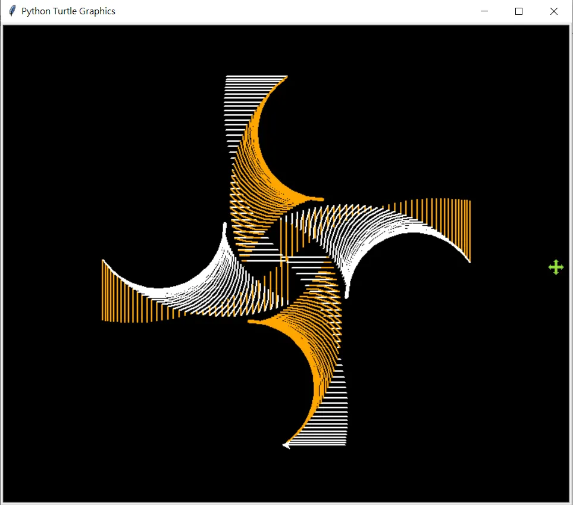
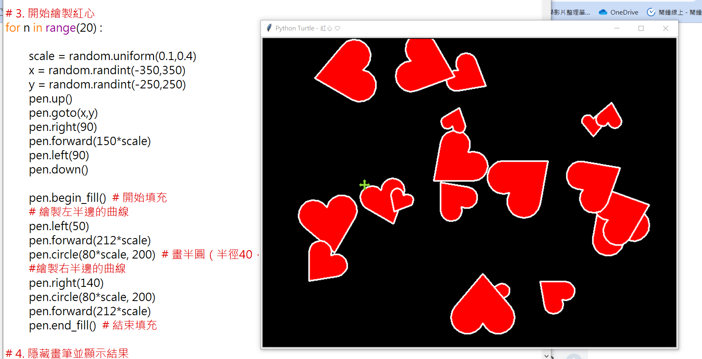
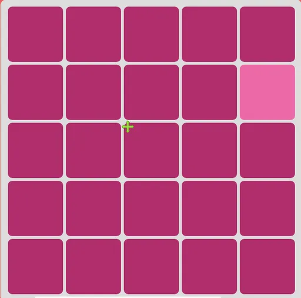

# Turtle Graphic應用
---
## 繪製螺旋狀的幾何圖案

```python
from turtle import *

# 初始化設定
setposition(-60, 0)  # 設定起始位置
speed(0)             # 最快繪圖速度
bgcolor("black")     # 黑色背景
colors = ["orange", "white"]  # 交替顏色
pensize(2)           # 畫筆粗細

# 繪製螺旋圖案
for i in range(150):
    color(colors[i % 2])  # 交替使用顏色
    right(i)              # 逐漸增加右轉角度
    circle(90, i)         # 繪製漸變圓弧
    penup()               # 抬筆移動
    forward(i + 50)       # 不規則前進
    pendown()             # 落筆繪圖
    right(90)             # 固定右轉90度
    forward(i - 65)       # 動態長度直線
    hideturtle()          # 隱藏烏龜圖標

# 完成繪圖
done()
```
---
## Random Red Heart

```python
import turtle
import random 

# 1. 創建 Screen 物件（畫布）
s1 = turtle.Screen()
s1.title("Python Turtle - 紅心 ❤️")
s1.bgcolor("black")
s1.setup(width=800, height=600)

# 2. 創建 Turtle 物件（畫筆）
p1 = turtle.Turtle()
p1.speed(0)
p1.color("white")
p1.fillcolor("red")
p1.pensize(3)

for n in range(20):
    
    # 3. 開始繪製紅心
    scale = random.uniform(0.2,0.5)
    x = random.randint(-350,350)
    y = random.randint(-250,250)
    p1.up()
    p1.goto(x,y)
    p1.seth(0)
    p1.rt(90)
    p1.fd(150*scale)
    p1.lt(90)
    p1.down()

    p1.begin_fill()

    # 繪製左半邊的曲線
    p1.lt(50)
    p1.fd(212*scale)
    p1.circle(80*scale, 200)  

    # 繪製右半邊的曲線
    p1.rt(140)       
    p1.circle(80*scale, 200)  
    p1.fd(212*scale)

    p1.end_fill()

# 4. 隱藏畫筆
p1.ht()

# 5. 點擊視窗關閉程式
s1.exitonclick()
```
---
## Turtle 色弱測驗

```python
import turtle
import random
import colorsys

def 給我顏色(飽和度, 亮度, 色差):
    # 產生接近的顏色
    h = random.random()
    sa = 飽和度
    l = 亮度

    base_rgb = colorsys.hls_to_rgb(h, l, sa)

    一般色 = []
    for item in base_rgb:
        一般色.append(int(item * 255))

    offset = random.choice([-色差, 色差])
    l = l + offset
    target_rgb = colorsys.hls_to_rgb(h, l, sa)

    特殊色 = []
    for item in target_rgb:
        特殊色.append(int(item * 255))

    return (一般色, 特殊色)

def 繪製圓角矩形(x,y,邊長,半徑) :
    t1.goto(x, y)
    t1.setheading(270)
    t1.forward(邊長 / 2)
    t1.setheading(0)

    t1.down()
    t1.begin_fill()
    t1.forward(邊長 / 2 - 半徑)
    t1.circle(半徑, 90)
    t1.forward(邊長 - 半徑 * 2)
    t1.circle(半徑, 90)
    t1.forward(邊長 - 半徑 * 2)
    t1.circle(半徑, 90)
    t1.forward(邊長 - 半徑 * 2)
    t1.circle(半徑, 90)
    t1.forward(邊長 / 2 - 半徑)
    t1.end_fill()
    t1.up()
    return None

s1 = turtle.Screen()  # 建構式  產生一個視窗物件
視窗寬度 = 視窗高度 = 600
s1.setup(視窗寬度, 視窗高度)
s1.bgcolor('white smoke')
s1.colormode(255)
s1.tracer(0)

間格 = 8
個數 = 4
目標 = random.randint(1,個數**2)
半徑 = 60 / 個數
邊長 = (視窗寬度-間格*(個數+1))/個數

t1 = turtle.Turtle()  # 建構式  產生一個小龜物件
t1.shape('turtle')
t1.turtlesize(2, 2)
一般色, 特殊色 = 給我顏色(0.5,0.7,0.1)
t1.pencolor(一般色)
t1.fillcolor(一般色)
t1.up()

計數 = 1
for m in range(個數):  # 控制列
    for n in range(個數):  # 控制行
        if 計數 == 目標 :
            t1.pencolor(特殊色)
            t1.fillcolor(特殊色)
        else :
            t1.pencolor(一般色)
            t1.fillcolor(一般色)
        x = - 視窗寬度 / 2 + 間格 * (n + 1) + 邊長 / 2 * (2 * n + 1)
        y = - 視窗高度 / 2 + 間格 * (m + 1) + 邊長 / 2 * (2 * m + 1)
        繪製圓角矩形(x, y, 邊長, 半徑)
        計數 += 1   #   -= 1  *= 2  /= 2

t1.hideturtle()
s1.exitonclick()
```
