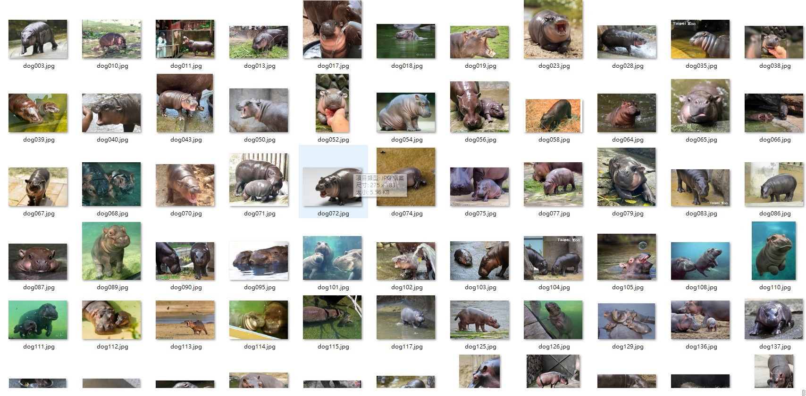
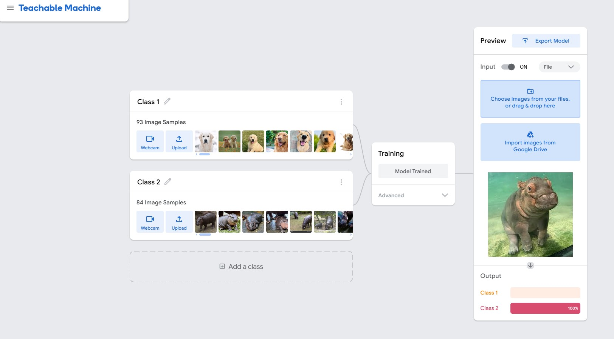
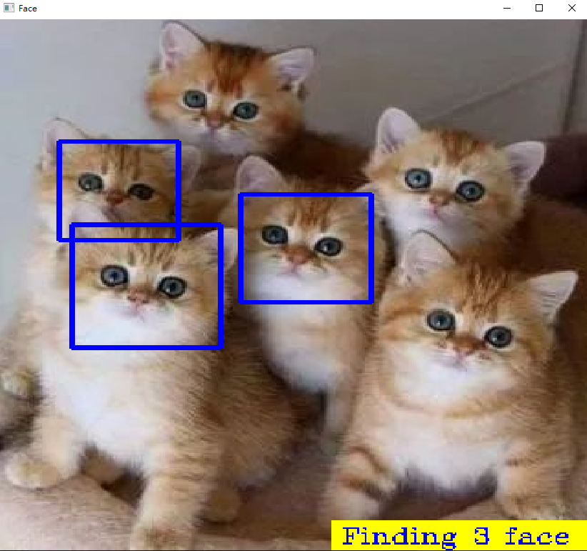
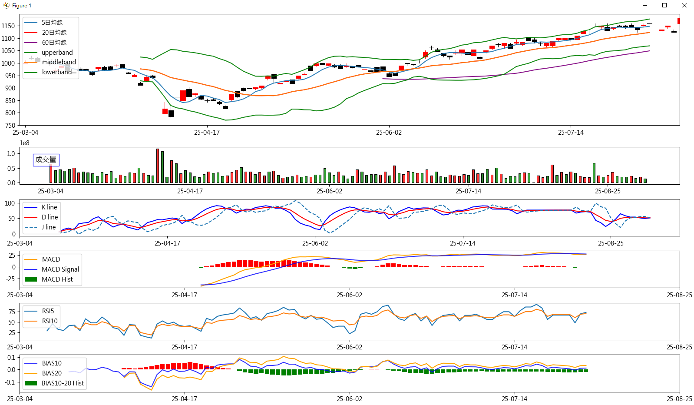

# AI基本技術應用
---

## 網路圖片下載(資料收集)

```python
from selenium import webdriver  # 導入網頁自動化工具
from bs4 import BeautifulSoup  # 導入HTML解析庫
import requests  # 導入HTTP請求庫
import time  # 導入時間庫（用於等待）
import base64  # 導入base64編解碼庫

# 設定搜尋關鍵字
search_query = "黃金獵犬"  # 可以替換成任何想搜尋的關鍵字

# 組建Google圖片搜尋網址
url = f"https://www.google.com/search?hl=en&tbm=isch&q={search_query}"

# 啟動Chrome瀏覽器
driver = webdriver.Chrome()
driver.maximize_window()  # 將瀏覽器視窗最大化
driver.get(url)  # 前往Google圖片搜尋頁面

time.sleep(5)  # 等待5秒讓頁面加载完成

# 滾動頁面以加載更多圖片（執行2次）
for n in range(2):
    driver.execute_script('window.scrollTo(0,document.documentElement.scrollHeight);')  # 滾動到頁面底部
    time.sleep(5)  # 每次滾動後等待5秒

# 使用set集合來儲存圖片網址（自動去除重複）
images = set()

# 解析網頁HTML內容
soup = BeautifulSoup(driver.page_source, 'html.parser')
# 尋找所有包含圖片的元素（class為"mNsIhb"）
g_imgs = soup.find_all(class_="mNsIhb")
print(len(g_imgs))  # 顯示找到的圖片數量

# 提取所有圖片的src屬性（圖片網址）
for g_img in g_imgs:
    images.add(g_img.contents[0]['src'])  # 將圖片網址加入集合

# 下載所有圖片
for idx, img_src in enumerate(images):
    # 設定檔案名稱（自動編號，補零到3位數）
    file_name = f'./dog_imgs/dog{str(idx).zfill(3)}.jpg'
    
    if img_src.startswith('data:image'):  # 如果是base64編碼的圖片
        header, encoded = img_src.split(",", 1)  # 分離base64資料
        with open(file_name, "wb") as f:  # 以二進位寫入模式開啟檔案
            f.write(base64.b64decode(encoded))  # 解碼並寫入檔案
        print(0)  # 輸出0表示base64圖片
    else:  # 如果是普通URL圖片
        response = requests.get(img_src)  # 發送HTTP請求獲取圖片
        with open(file_name, "wb") as f:  # 以二進位寫入模式開啟檔案
            f.write(response.content)  # 將圖片內容寫入檔案
        print(1)  # 輸出1表示URL圖片
```
---

## 簡易機器模型訓練-影像相似度比對


---

## OpenCV-圖片臉部偵測

```python
# OpenCV Haar Cascade 人臉偵測測試
import cv2

pictPath = r'haarcascade_frontalcatface.xml'
face_cascade = cv2.CascadeClassifier(pictPath) #建立辨識物件
img = cv2.imread("121c2823303b4497a13f40f3f3b50847.jpeg") #讀取影像
faces = face_cascade.detectMultiScale(img, scaleFactor=1.1,
        minNeighbors = 3, minSize=(20,20))
#標註右下角底色是黃色
cv2.rectangle(img, (img.shape[1]-140, img.shape[0]-20),
              (img.shape[1],img.shape[0]), (0,255,255), -1)
#標註找到多少的人臉
cv2.putText(img, "Finding " + str(len(faces)) + " face",
            (img.shape[1]-135, img.shape[0]-5),
            cv2.FONT_HERSHEY_COMPLEX, 0.5, (255,0,0), 1)
#將人臉框起來,由於有可能找到好幾個臉所以用迴圈繪出來
for (x,y,w,h) in faces:
    cv2.rectangle(img,(x,y),(x+w,y+h),(255,0,0),2)  #藍色框住人臉

cv2.namedWindow("Face",0)
cv2.imshow("Face", img)  #顯示影像

cv2.waitKey(0)
cv2.destroyAllWindows()
```
---

## 臉部特徵點偵測

```python
# dlib_test

import numpy as np
import cv2                #影像處理模組 OpenCV
import dlib               #人臉識別模組 dlib

# dlib
detector = dlib.get_frontal_face_detector()    # 使用dlib模組提供的人臉偵測函式，基於HOG特徵，建立找尋人臉的物件
cnn_face_detector = dlib.cnn_face_detection_model_v1('mmod_human_face_detector.dat')
predictor = dlib.shape_predictor('shape_predictor_68_face_landmarks.dat')
# 人臉68個特徵形狀預測物件的產生，是基于 Ensemble of Regression Trees 理論

# cv2讀取影像
def cv2_imread(filePath):
    cv_img = cv2.imdecode( np.fromfile(filePath,dtype=np.uint8) , cv2.IMREAD_UNCHANGED )
    return cv_img

img = cv2.imread(r'maxresdefault.jpg')

cv2.namedWindow("img0", 0)
cv2.imshow("img0", img)       #顯示影象


# 取灰度
img_gray = cv2.cvtColor(img, cv2.COLOR_RGB2GRAY)

# 先看到人臉在甚麼地方
rects = detector(img_gray, 1) # 人臉方框的矩形左上右下座標
# 上面第二個參數：
# upsample_num_times：表示在進行偵測之前，要將圖片"放大"幾次；次數越多越能偵測到比較小的人臉，但花費的時間也更長
#dets = cnn_face_detector(img_gray, 0)
#rects1 = dlib.rectangles()
#rects1.extend([d.rect for d in dets])
#print(rects)
#print(rects1)


for i in range(len(rects)):
    landmarks = np.array([ [p.x, p.y]  for p in predictor( img, rects[i] ).parts() ])  #人臉關鍵點識別預測
    for idx, point in enumerate(landmarks):        #enumerate函式遍歷序列中的元素及它們的下標
        # 68點的座標
        pos = (point[0], point[1])
        #print(idx,pos)

        # 利用cv2.circle給每個特徵點畫一個圈，共68個
        cv2.circle(img, pos, 5, (0, 255, 0), -1)
        # 利用cv2.putText輸出1-68
        #font = cv2.FONT_HERSHEY_SIMPLEX
        #各引數依次是：圖片，新增的文字，座標，字型，字型大小，顏色，字型粗細
        #cv2.putText(img, str(idx+1), pos, font, 0.4, (0, 255, 255), 1 ,cv2.LINE_AA)

cv2.namedWindow("img", 0)
cv2.imshow("img", img)       #顯示影象
cv2.imwrite("linda2.jpg", img)
cv2.waitKey(0)        #等待按鍵，隨後退出
```
---

## Mediapipe-全身偵測

```python
# mediapipe_test

import cv2
import mediapipe as mp
import numpy as np

mp_drawing=mp.solutions.drawing_utils
mp_holistic=mp.solutions.holistic
'''
If you have this error:

[ WARN:0] global D:\a\opencv-python\opencv-python\opencv\modules\videoio\src\cap_msmf.cpp (438) `anonymous-namespace'::SourceReaderCB::~SourceReaderCB terminating async callback
You must replace line 3
cam = cv2.VideoCapture(1)
with
cam = cv2.VideoCapture(0, cv2.CAP_DSHOW)
'''
# cap = cv2.VideoCapture(0)
cap = cv2.VideoCapture(0, cv2.CAP_DSHOW)

with mp_holistic.Holistic(min_detection_confidence=0.5, min_tracking_confidence=0.5) as holistic:
    while cap.isOpened():
        ret, frame = cap.read()

        # Convert the feed from BGR to RGB
        image = cv2.cvtColor(frame, cv2.COLOR_BGR2RGB)
        # Refer the section above how to make detections on feed
        results = holistic.process(image)

        # Recolor image back to BGR for rendering
        image = cv2.cvtColor(image, cv2.COLOR_RGB2BGR)

        # 1. Draw face landmarks
        mp_drawing.draw_landmarks(image, results.face_landmarks, mp_holistic.FACEMESH_TESSELATION,
                                  mp_drawing.DrawingSpec(color=(120, 110, 10), thickness=1, circle_radius=1),
                                  mp_drawing.DrawingSpec(color=(120, 256, 121), thickness=1, circle_radius=1)
                                  )

        # 2. Draw Right hand landmarks
        mp_drawing.draw_landmarks(image, results.right_hand_landmarks, mp_holistic.HAND_CONNECTIONS,
                                  mp_drawing.DrawingSpec(color=(80, 22, 10), thickness=2, circle_radius=4),
                                  mp_drawing.DrawingSpec(color=(80, 44, 121), thickness=2, circle_radius=2)
                                  )

        # 3. Draw Left Hand landmarks
        mp_drawing.draw_landmarks(image, results.left_hand_landmarks, mp_holistic.HAND_CONNECTIONS,
                                  mp_drawing.DrawingSpec(color=(121, 22, 76), thickness=2, circle_radius=4),
                                  mp_drawing.DrawingSpec(color=(121, 44, 250), thickness=2, circle_radius=2)
                                  )

        # 4. Draw Pose Detections
        mp_drawing.draw_landmarks(image, results.pose_landmarks, mp_holistic.POSE_CONNECTIONS,
                                  mp_drawing.DrawingSpec(color=(245, 117, 66), thickness=2, circle_radius=4),
                                  mp_drawing.DrawingSpec(color=(245, 66, 230), thickness=2, circle_radius=2)
                                  )

        cv2.imshow('Holistic Model Detections', image)

        if cv2.waitKey(10) & 0xFF == ord('q'):
            break

cap.release()
cv2.destroyAllWindows()
```
---

## Mpl_finance, talib 股票技術分析

```python
# mpl_finance模組及talib模組測試

import requests
import pandas as pd
from datetime import datetime

# 設定請求 URL  Brent Crude Oil Last Day Financ(BZ=F)
url = "https://query1.finance.yahoo.com/v8/finance/chart/2330.TW?range=6mo&interval=1d"

# 設定請求頭部 (模仿瀏覽器請求)
headers = {
    'User-Agent': 'Mozilla/5.0 (Windows NT 10.0; Win64; x64) AppleWebKit/537.36 (KHTML, like Gecko) Chrome/91.0.4472.124 Safari/537.36'
}

# 發送 GET 請求
response = requests.get(url, headers=headers)

if response.status_code == 200:
    # 解析 JSON 數據
    data = response.json()

    # 從 JSON 中提取股票數據
    chart_data = data['chart']['result'][0]

    # 獲取時間戳和收盤價
    timestamps = chart_data['timestamp']

    # 將時間戳轉換為日期格式
    dates = [datetime.fromtimestamp(ts) for ts in timestamps]

    # 在創建 DataFrame 的部分擴展為：
    df = pd.DataFrame({
        'Date': dates,
        'Open': chart_data['indicators']['quote'][0]['open'],
        'High': chart_data['indicators']['quote'][0]['high'],
        'Low': chart_data['indicators']['quote'][0]['low'],
        'Close': chart_data['indicators']['quote'][0]['close'],
        'Volume': chart_data['indicators']['quote'][0]['volume']
    })

    # 設置日期為索引
    df.set_index('Date', inplace=True)

    # 顯示前幾行數據
    print("成功獲取台積電(2330.TW)股票數據:")
    print(df.tail())
else:
    print(f"請求失敗，狀態碼: {response.status_code}")
    print("可能的原因:")
    print("1. 股票代碼不正確 (試試 2330.TWO)")
    print("2. Yahoo Finance API 暫時不可用")
    print("3. 你的IP被暫時限制")

import yfinance as yf
from datetime import datetime
import matplotlib.pyplot as plt
import mpl_finance as mpf
from talib import abstract  # 技術指標用
import numpy as np
import pandas as pd
import matplotlib
# matplotlib.rc('font', family='Microsoft JhengHei')
plt.rcParams['font.sans-serif'] = ['Microsoft JhengHei']  # 修改中文字體
plt.rcParams['axes.unicode_minus'] = False  # 顯示負號
#df.columns = [col[0] for col in df.columns.values]

df['ma5'] = abstract.SMA(np.array(df['Close']),5)
df['ma10'] = abstract.SMA(np.array(df['Close']),10)
df['ma20'] = abstract.SMA(np.array(df['Close']),20)
df['ma60'] = abstract.SMA(np.array(df['Close']),60)

df_bbnds = abstract.BBANDS(np.array(df['Close']), timeperiod=20, nbdevup=2.0, nbdevdn=2.0, matype=0)

# 根據你的需求計算KD線、MACD和RSI
low_list = df['Low'].rolling(9, min_periods=9).min()
high_list = df['High'].rolling(9, min_periods=9).max()
rsv = (df['Close'] - low_list) / (high_list - low_list) * 100
df["RSV"]=rsv
# 計算K, D, J值
df['%K'] = pd.DataFrame(rsv).ewm(com=2).mean()
df['%D'] = df['%K'].ewm(com=2).mean()
df['%J'] = 3*df['%D'] - 2*df['%K']
#df_kd = abstract.STOCH(df['High'], df['Low'], df['Close'], fastk_period=9, slowk_period=3, slowd_period=3)
#df['%K'] = df_kd[0]
#df['%D'] = df_kd[1]
#df['%J'] = 3*df_kd[1]-2*df_kd[0]
#df['3K-2D'] = 3*df_kd[0]-2*df_kd[1]
#df['RSV'] = (df['Close']-df['Close'].rolling(window=9).min())/(df['Close'].rolling(window=9).max()-df['Close'].rolling(window=9).min())*100
#技術指標-WILLR值
df['%R'] = abstract.WILLR(df['High'], df['Low'], df['Close'], timeperiod=9)

df_macd = abstract.MACD(df['Close'], fastperiod=12, slowperiod=26, signalperiod=9)
df['MACD'] = df_macd[0]
df['MACD Signal'] = df_macd[1]
df['MACD Histogram'] = df_macd[2]

df['RSI5'] = abstract.RSI(df['Close'],timeperiod=5)
df['RSI10'] = abstract.RSI(df['Close'],timeperiod=10)

df['BIAS10'] = (df['Close']- df['ma10'])/df['ma10']
df['BIAS20'] = (df['Close']- df['ma20'])/df['ma20']
df['BIAS10_20'] = df['BIAS10'] - df['BIAS20']

df.index = df.index.format(formatter=lambda x : x.strftime('%y-%m-%d'))
fig = plt.figure(figsize=(16,18), layout='constrained')
ax1 = fig.add_subplot(9,1,(1,3))  # 共七列一行  我們要占用一二列
ax1.set_xticks(range(0,len(df.index),30))
ax1.set_xticklabels(df.index[::30])
mpf.candlestick2_ochl(ax1, df['Open'], df['Close'], df['High'], df['Low'], width=0.8, colorup='r', colordown='k', alpha=1)
ax1.plot(df['ma5'],label='5日均線',alpha=0.9)
ax1.plot(df['ma20'],label='20日均線',alpha=0.9,color='r')
ax1.plot(df['ma60'],label='60日均線',alpha=0.9,color='purple')
ax1.plot(df_bbnds[0], label='upperband',alpha=0.9,color='g')
ax1.plot(df_bbnds[1], label='middleband',alpha=0.9)
ax1.plot(df_bbnds[2], label='lowerband',alpha=0.9,color='g')
ax1.legend(loc=2)

ax2 = fig.add_subplot(9,1,4)  # 共七列一行  我們要占用第四列
ax2.set_xticks(range(0,len(df.index),30))
ax2.set_xticklabels(df.index[::30])
title_bbox = dict(boxstyle='square', facecolor='white', edgecolor='blue', alpha=0.7)
ax2.set_title('成交量',bbox=title_bbox, x=0.04, y=0.5)
mpf.volume_overlay(ax2, df['Open'], df['Close'], df['Volume'], colorup='r', colordown='g', width=0.5, alpha=0.8)

# 新增一個子圖來顯示KD線
ax3 = fig.add_subplot(9,1,5)
ax3.plot(df['%K'], label='K line',color='b')
ax3.plot(df['%D'], label='D line',color='r')
ax3.plot(df['%J'], label='J line',linestyle='--')
ax3.set_xticks(range(0,len(df.index),30))
ax3.set_xticklabels(df.index[::30])
ax3.legend(loc=2)

# 新增一個子圖來顯示MACD
ax4 = fig.add_subplot(9,1,6)
ax4.plot(df['MACD'], label='MACD',color='orange')
ax4.plot(df['MACD Signal'], label='MACD Signal',color='blue',alpha=0.8)
macd_colors = np.where(df['MACD Histogram'] >= 0, 'r', 'g')
ax4.bar(df.index, df['MACD Histogram'], label='MACD Hist', color=macd_colors)
ax4.set_xticks(range(0,len(df.index),30))
ax4.set_xticklabels(df.index[::30])
ax4.legend(loc=2)

# 新增一個子圖來顯示RSI
ax5 = fig.add_subplot(9,1,7)
ax5.plot(df['RSI5'], label='RSI5')
ax5.plot(df['RSI10'], label='RSI10')
ax5.set_xticks(range(0,len(df.index),30))
ax5.set_xticklabels(df.index[::30])
ax5.legend(loc=2)

# 新增一個子圖來顯示BIAS
ax6 = fig.add_subplot(9,1,8)
ax6.plot(df['BIAS10'], label='BIAS10',color= 'blue',alpha=0.8)
ax6.plot(df['BIAS20'], label='BIAS20',color= 'orange')
bias_colors = np.where(df['BIAS10_20'] >= 0, 'r', 'g')
ax6.bar(df.index, df['BIAS10_20'], label='BIAS10-20 Hist', color=bias_colors)
ax6.set_xticks(range(0,len(df.index),30))
ax6.set_xticklabels(df.index[::30])
ax6.legend(loc=2)

# 新增一個子圖來顯示WILLR值
ax7 = fig.add_subplot(9,1,9)
ax7.plot(df['%R'], label='WILLR 9')
ax7.set_xticks(range(0,len(df.index),30))
ax7.set_xticklabels(df.index[::30])
ax7.legend(loc='lower left')
plt.show()
```
